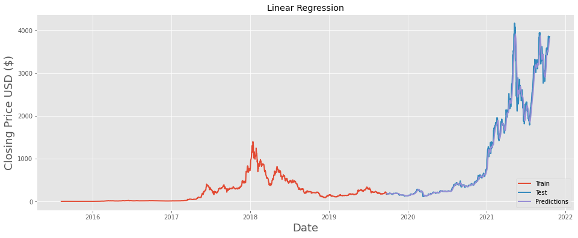
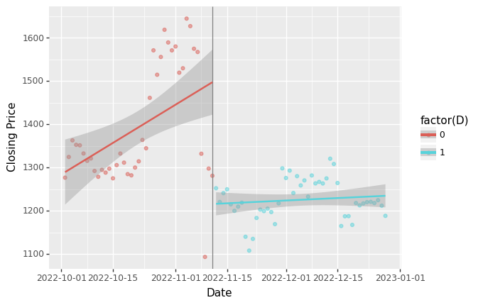

# Ethereum Price Prediction and the impact of FTX's bankrupty on the Ethereum Price
## General information
- **Author**: Haowen Ji, Data Science, Class 2023, Duke Kunshan University
- **Instructor**: Prof. Luyao Zhang, Duke Kunshan University
- **Disclaimer**: Submissions to the final project for [STATS201 Introduction to Machine Learning for Social Science, 2023 Spring Term (Seven Week - First)](https://ms.pubpub.org/) instructed by Prof. Luyao Zhang at Duke Kunshan University.
- **Acknowledgments**: I would like to thank Prof. Luyao Zhang for her instructions on STATS201 and thanks all the classmates for the inspiring discussions and feedbacks. 

## Project Summary
**1. Explanation project:** 
* Background & Motivation: Cryptocurrencies have emerged as a popular investment and payment option in recent years, and the cryptocurrency market has grown rapidly (Canh, Binh, and Thanh 2019). However, the volatility of cryptocurrency prices has posed significant challenges for stakeholders. As a result, there is a growing interest in the development of accurate and reliable cryptocurrency price prediction models to assist investors in making informed decisions. The development of cryptocurrency price prediction models is challenging due to the complexity and unpredictability of the cryptocurrency market (Ametrano 2014). One approach to improving cryptocurrency price prediction is using an explanation, which involves identifying the key factors that drive cryptocurrency prices. The explanation provides a more transparent and interpretable approach to price prediction.
* Research Question: What are the hot topics in the cryptocurrency price prediction field?
* Application Scenario: This project is applied to 12 papers related to the cryptocurrency price prediction. These literatures are collected by keyword searching in [google scholar](https://scholar.google.com/), and their titles and abstracts are used for the natural language processing (Ritchie 1982) task.
* Methodology: The machine learning methodology explanation is used in this project, especially, word cload and bigram are used for text analysis. 
* Results: The results shows some new high-frequency words and new relationship of keywords. 
* Intellectual Merit & Practical Impacts: The study contributes to the transparency and interpretability of cryptocurrency price prediction tasks. The study's results and implications can inform the development of more effective cryptocurrency price prediction models, ultimately assisting investors in making informed decisions in a volatile market. For future work, more literature can be collected to generate more robust results and more sophisticated explanation models that integrate both quantitative and qualitative data can be developed to enhance the transparency and interpretability of cryptocurrency price prediction models.

**2. Preidcation project:** 
* Background & Motivation: Ethereum has a large market cap, while its price predictability is not much addressed in the published literature. 
* Research Qeustion: Thus, this project focuses on the research question that how effetive is machine learning algorithmns in predicting Etherem open price. 
* Application Senerios: This project is applied to the Ethereum opening price from 2015 to 2021. The machine learning methodology prediction is used in this project. 
* Methodology: The machine learning methodology explanation is used in this project. Natural language processing is applied to extract the text information, then word cloud and bigram are used for text analysis. 
* Results: The word cloud shows that when it comes to predicting cryptocurrency prices, the most popular digital currencies used for this task are Bitcoin and Ethereum. Additionally, we noticed that machine learning methods are commonly used for this type of prediction, and there is a lot of interest in time-series forecasting techniques. Overall, these findings suggest that those looking to predict cryptocurrency prices should focus on these two currencies and consider utilizing machine learning and time-series analysis techniques.
* Intellectual Merit & Practical Impacts: This project contributes to the times series data prediction, especially in the Ethereum value prediction. More researches on more kinds of machine learning models and more features related to the price prediction can be conducted in the future.

**3. Casual inference project:** 
* Background & Motivation: In recent years, the popularity of cryptocurrencies as a means of investment and payment has increased significantly. However, the potential risks associated with these new financial systems, including bankruptcy, have not been fully understood. Bankruptcy, a common occurrence in centralized finance, can have significant impacts on the price and other aspects of financial systems (Devi and Radhika 2018). However, little research has been done to investigate the impact of bankruptcy on the cryptocurrency market (Abdillah and Hendrawan 2022). To address this research gap, I investigate the impact of the Futures Exchange (FTX) bankruptcy on the price of Ethereum, a popular decentralized digital asset. FTX is a representative example of cryptocurrency derivatives exchanges, which are relatively new and rapidly growing. Ethereum is chosen because of its decentralized nature (Zhang, Ma, and Liu 2022), which offers insights into the risks and opportunities of decentralized finance and cryptocurrencies. My study aims to contribute to a better understanding of the impact of bankruptcy on the cryptocurrency market and inform stakeholders of the potential risks and opportunities of investing in these new financial systems.
* Research Qeustion: What is the causal relationship between the bankruptcy of FTX and the price of Ethereum?
* Application Senerios: The data is extracted from Coin Metrics (Coin Metrics 2023). The data has two attributes, the first one is the date and the second is the closing price of Ethereum corresponding to each day in the unit ETH / USD. The date is the x variable, and it ranges from 2015/8/8 to 2023/2/23. The Y variable is the closing price of Ethereum, which ranges from 0.420000 to 4811.156463. The trend of the whole data is shown in Figure 1. It is obvious that the price of Ethereum has increased significantly overall since its release, but there has been a lot of fluctuation. The area between the orange line and the red line is the period of FTX bankruptcy. These two dates will be put into the regression discontinuity design as the representation of FTX bankruptcy separately. 
* Methodology: The regression discontinuity is employed in this research, which is a statistical method commonly used to estimate the causal effects of an intervention on an outcome of interest. In this research, regression discontinuity can be examined whether there is a discontinuity in the trend of Ethereum prices at the time of FTX bankruptcy. The linear regression is used to fit separately the data from two groups: Ether price before and after FTX bankruptcy.
* Results: The results of the regression discontinuity analysis shows a clear discontinuity in the Ethereum price following the FTX bankruptcy. This finding is consistent with our prior expectations, suggesting that the FTX bankruptcy had a significant causal effect on the Ethereum price. Furthermore, it indicates a gradual increase in Ethereum price over time after the event, implying that the impact of the FTX bankruptcy is likely to have diminished over time.
* Intellectual Merit & Practical Impacts: The study presented in this paper contributes to the intellectual discourse surrounding the impact of bankruptcy on the cryptocurrency market, which has not been extensively explored in previous research. The findings of this study have important implications for stakeholders, including investors, regulators, and policymakers, who need to have a better understanding of the risks associated with these new financial systems. Furthermore, the decentralized nature of Ethereum, which is a focus of this study, offers insights into the risks and opportunities of decentralized finance and cryptocurrencies, which have the potential to transform the traditional financial system. There are several possible directions for future research based on the findings of this study. First, additional research could explore the effects of bankruptcy on other cryptocurrencies and decentralized financial systems with the methodology used in this research. Second, further research could investigate the potential mechanisms underlying the observed effects of bankruptcy on the price of Ethereum. Third, given the rapid evolution of the cryptocurrency market and decentralized finance, ongoing research is necessary to stay abreast of emerging risks and opportunities in this rapidly changing field.

## Table of Contents

- [Data](https://github.com/Rising-Stars-by-Sunshine/Haowen-STATS201-Final#data)
- [Code](https://github.com/Rising-Stars-by-Sunshine/Haowen-STATS201-Final#code)
- [Spotlight](https://github.com/Rising-Stars-by-Sunshine/Haowen-STATS201-Final#spotlight)
- [More about the Author](https://github.com/Rising-Stars-by-Sunshine/Haowen-STATS201-Final#more-about-the-author)
- [References](https://github.com/Rising-Stars-by-Sunshine/Haowen-STATS201-Final#references) 

## Data

### Data Source: 
- [Ethereum (ETH-USD) Historical Dataset(Kaggle)](https://www.kaggle.com/datasets/abhimaneukj/ethereum-historical-dataset)
- [Coin Metrics](https://charts.coinmetrics.io/network-data/)

### Meta Data Information

| Data files| Data Content | Type|
| ------------- | ------------- | ------------- |
| [Literatures.csv](https://github.com/Rising-Stars-by-Sunshine/Haowen-STATS201-Final/blob/main/data/Explanation/Literatures.csv) | Literatures collected for explanation | queried data |
| [title_bigram.csv](https://github.com/Rising-Stars-by-Sunshine/Haowen-STATS201-Final/blob/main/data/Explanation/title_bigram.csv) | The title biagram for the literatures collected | processed data |
| [abstract_bigram.csv](https://github.com/Rising-Stars-by-Sunshine/Haowen-STATS201-Final/blob/main/data/Explanation/abstract_bigram.csv) |  The abstract biagram for the literatures collected | processed data |
| [ETHUSD.csv](https://github.com/Rising-Stars-by-Sunshine/Haowen-STATS201-Final/blob/main/data/Prediction/ETHUSD.csv) | Ethereum historical data from 2015 to 2021 | queried data |
| [Ethereum_value.csv](https://github.com/Rising-Stars-by-Sunshine/Haowen-STATS201-Final/blob/main/data/Prediction/Ethereum_value.csv) | Ethereum data after preprocessing | processed data |
| [Regression_Train.csv](https://github.com/Rising-Stars-by-Sunshine/Haowen-STATS201-Final/blob/main/data/Prediction/Regression_Train.csv) | Data for model training | processed data |
| [Regression_Test.csv](https://github.com/Rising-Stars-by-Sunshine/Haowen-STATS201-Final/blob/main/data/Prediction/Regression_Test.csv) | Data for model test | processed data |
| [Ethereum_Data.csv](https://github.com/Rising-Stars-by-Sunshine/Haowen-STATS201-Final/blob/main/data/Causal%20Inference/Ethereum_Data.csv) | The closing price of Ethereum from 2015 to 2023 | queried data |

### Data Dictionary

| File Name  | Variable Name | Description | Frecuency | Unit | Type |
| ------------- | ------------- | ------------- | ------------- | ------------- | ------------- |
| [Literatures.csv](https://github.com/Rising-Stars-by-Sunshine/Haowen-STATS201-Final/blob/main/data/Explanation/Literatures.csv) | Title  | The titles of 12 literatures related to cryptocurrency prediction  | 1  | None  | str  |
|   | Abstract  | The abstracts of 12 literatures related to cryptocurrency prediction  | 1  | None  | str  |
| [title_bigram.csv](https://github.com/Rising-Stars-by-Sunshine/Haowen-STATS201-Final/blob/main/data/Explanation/title_bigram.csv)  | bigram  | The biagram of titles | None  | None  | tuple  |
|   | 	counts  | The frequency of occurrence for each bigram  | None  | None  | int  |
| [abstract_bigram.csv](https://github.com/Rising-Stars-by-Sunshine/Haowen-STATS201-Final/blob/main/data/Explanation/abstract_bigram.csv)  | bigram  | The abstract of abstracts bigram | None  | None  | tuple  |
|   | 	counts  | The frequency of occurrence for each bigram  | None  | None  | int  |
| [ETHUSD.csv](https://github.com/Rising-Stars-by-Sunshine/Haowen-STATS201-Final/blob/main/data/Prediction/ETHUSD.csv)  | Date  | The date of the collected data from 2015-08-07 to 2021-10-20 | monthly  |  month  | Object |
|   | Open | The opening price of the Ethereum | monthly |USD| float|
|   | Close | The closing price of the Ethereum | monthly |USD| float|
 | [Ethereum_value.csv](https://github.com/Rising-Stars-by-Sunshine/Haowen-STATS201-Final/blob/main/data/Prediction/Ethereum_value.csv)  | Date  | The processed date time from ETHUSD  | monthly  | month  | datetime  |
| [Regression_Train.csv](https://github.com/Rising-Stars-by-Sunshine/Haowen-STATS201-Final/blob/main/data/Prediction/Regression_Train.csv) | 6-month-ma  | The mean value of the closing price for the past 6 months | monthly | USD  | float  |
| [Regression_Test.csv](https://github.com/Rising-Stars-by-Sunshine/Haowen-STATS201-Final/blob/main/data/Prediction/Regression_Test.csv) | 6-month-ma  | The mean value of the closing price for the past 6 months | monthly | USD  | float  
 | [Ethereum_Data.csv](https://github.com/Rising-Stars-by-Sunshine/Haowen-STATS201-Final/blob/main/data/Causal%20Inference/Ethereum_Data.csv) | ETH / USD Denominated Closing Price  | The closing price of Ethereum from 2015-08-07 to 2021-10-20  | monthly  | USD  | float  |

## Code
- [Query Data for Explanation](https://github.com/Rising-Stars-by-Sunshine/Haowen-STATS201-Final/blob/main/code/Explanation/Haowen_NLP_Explanation.ipynb)
- [Query Data for Prediction](https://github.com/Rising-Stars-by-Sunshine/Haowen-STATS201-Final/blob/main/code/Prediction/Query_Ethereum_Data.ipynb)
- [Process Data for Prediction](https://github.com/Rising-Stars-by-Sunshine/Haowen-STATS201-Final/blob/main/code/Prediction/Process_Data_Prepare_X_and_Y_for_Regressions.ipynb)
- [Analyze Data for Prediction](https://github.com/Rising-Stars-by-Sunshine/Haowen-STATS201-Final/blob/main/code/Prediction/Analyze_Data_Machine_Learning_for_Predicting.ipynb)
- [Process and Analyze Data for Causal Inference](https://github.com/Rising-Stars-by-Sunshine/Haowen-STATS201-Final/blob/main/code/Causal-Inference/Regression_Discontinuity.ipynb)

### Table of Code

 
| Code files| Description | Type| Task| Emoji|
| :---         |     :---     | :--- | :---| :---:|
| [Haowen_NLP_Explanation.ipynb](https://github.com/Rising-Stars-by-Sunshine/Haowen-STATS201-Final/blob/main/code/Explanation/Haowen_NLP_Explanation.ipynb) | This code applied machine learning method for open price regression| .ipynb | Explanation| :page_with_curl:|
| [Query_Ethereum_Data.ipynb](https://github.com/Rising-Stars-by-Sunshine/Haowen-STATS201-Final/blob/main/code/Prediction/Query_Ethereum_Data.ipynb)  | This code deals with the read and preprocessing of the original dataset | .ipynb | Prediction | :moneybag: |
| [Process_Data_Prepare_X_and_Y_for_Regressions.ipynb](https://github.com/Rising-Stars-by-Sunshine/Haowen-STATS201-Final/blob/main/code/Prediction/Process_Data_Prepare_X_and_Y_for_Regressions.ipynb) | This code processed the X and Y dataset from Ethereum_value.csv for regression  | .ipynb | Prediction| :tada: | 
| [Analyze_Data_Machine_Learning_for_Predicting.ipynb](https://github.com/Rising-Stars-by-Sunshine/Haowen-STATS201-Final/blob/main/code/Prediction/Analyze_Data_Machine_Learning_for_Predicting.ipynb) | This code applied machine learning method for open price regression| .ipynb | Prediction | :chart_with_upwards_trend: |
| [Analyze_Data_Machine_Learning_for_Predicting.ipynb](https://github.com/Rising-Stars-by-Sunshine/Haowen-STATS201-Final/blob/main/code/Causal-Inference/Regression_Discontinuity.ipynb) | This code applied machine learning method for open price regression| .ipynb | Causal Inference| :paperclip: |
 
 

## Spotlight

### Poster

*Figure 1: Poster of the final project*

- An illustrated poster in Figure 1. briefly describes the research project. Contents include: *Background and Motivation*, *Research Question*, *Application Scenario (Data Source)*, *Methodology*,*Results*, and *Intellectual Merits and Practical impacts*. This poster in Figure 1 is created by 

### Explaination

 Figure 2: The wordcloud of the collected literatures 

- [Code source](https://github.com/Rising-Stars-by-Sunshine/Haowen-STATS201-Final/blob/main/code/Explanation)
- [Data source](https://github.com/Rising-Stars-by-Sunshine/Haowen-STATS201-Final/tree/main/data/Explanation)
- Description: from figure 1, the words NFT, market, prediction appear with a high fequency, which is accored with expectation. However, the word dynamic and trajectory are also high-frequency words. Thus, more researches related to NFT prediction can be conducted in these two aspects in the future.

### Prediction

 Figure 3: The prediction result of ethereum open price by linear regression 

- [Code source](https://github.com/Rising-Stars-by-Sunshine/Haowen-STATS201-Final/blob/main/code/Prediction)
- [Data source](https://github.com/Rising-Stars-by-Sunshine/Haowen-STATS201-Final/tree/main/data/Prediction)
- Description: from figure 1, it is obvious that the predicted result is very close to the real open price value. The result is evaluated by R2 score, which is 0.984. The R-squre determines the proportion of variance, which shows how well the data fit the regression mode(Chicco, Warrens, and Jurman 2021). The closer the r-squared value is to 1, the better the fit. Thus, the linear regression reached a high accuracy regarding the r-squared value.

### Causal Inference

 Figure 4: The casual inference result of the impact of FTX's bankruptcy on ethereum price 

- [Code source](https://github.com/Rising-Stars-by-Sunshine/Haowen-STATS201-Final/blob/main/code/Causal-Inference)
- [Data source](https://github.com/Rising-Stars-by-Sunshine/Haowen-STATS201-Final/tree/main/data/Causal%20Inference)
- Description: from figure 1, it is obvious that the predicted result is very close to the real open price value. The result is evaluated by R2 score, which is 0.984. The R-squre determines the proportion of variance, which shows how well the data fit the regression mode(Chicco, Warrens, and Jurman 2021). The closer the r-squared value is to 1, the better the fit. Thus, the linear regression reached a high accuracy regarding the r-squared value.

## More about the Author

 

 
- **Self Introduction**: 
Haowen Ji is a senior student in Data Science major at DKU, who is intereted in the data science’s application in the real world, such as price evaluation and automatic driving and still seeking more implementation opportunities to leverage data science.
- **Final Reflections**:
  - Intellectual Growth
  - Professional Growth
  - Living a Purposeful Life

## References

### Data Source
- [Ethereum Historical Dataset](https://www.kaggle.com/datasets/abhimaneukj/ethereum-historical-dataset)
- [Coin Metrics](https://charts.coinmetrics.io/network-data/)
### Code Source
- [design-principle-blockchain/code](https://github.com/sunshineluyao/design-principle-blockchain)
- [Rising-Stars-by-Sunshine/stats201-tutorial-prediction](https://github.com/Rising-Stars-by-Sunshine/stats201-tutorial-prediction/tree/main/code)
- [Regression_Discontinuity](https://colab.research.google.com/drive/11H4VxW9d3aCrsJ9zE7acfxh76YGQPas7?usp=sharing)
### Articles
- [Predicting Price Changes in Ethereum](https://cs229.stanford.edu/proj2017/final-reports/5244039.pdf)
- [The Coefficient of Determination R-Squared Is More Informative than SMAPE, MAE, MAPE, MSE and RMSE in Regression Analysis Evaluation](https://www.ncbi.nlm.nih.gov/pmc/articles/PMC8279135/)
### Literature
- Chen, Matthew, Neha Narwal, and Mila Schultz. 2019. “Predicting Price Changes in Ethereum.” *International Journal on Computer Science and Engineering (IJCSE) ISSN*: 0975-3397.

- Chicco, Davide, Matthijs J. Warrens, and Giuseppe Jurman. 2021. “The Coefficient of Determination R-Squared Is More Informative than SMAPE, MAE, MAPE, MSE and RMSE in Regression Analysis Evaluation.” PeerJ Computer Science 7 (July): e623. https://doi.org/10.7717/peerj-cs.623.

- Zhang, Luyao (Sunshine). 2022. “Machine Learning for Predictions.” Machine Learning for Social Science, November-. https://ms.pubpub.org/pub/ml-prediction/release/4.
